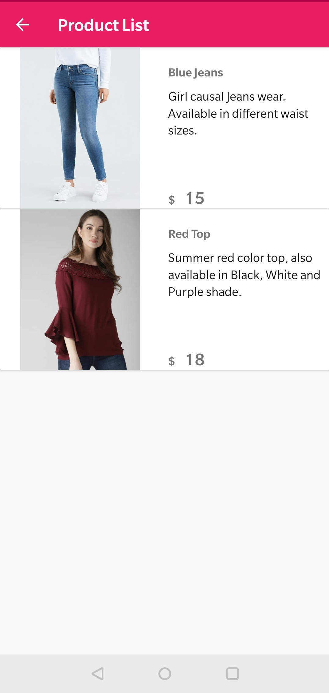
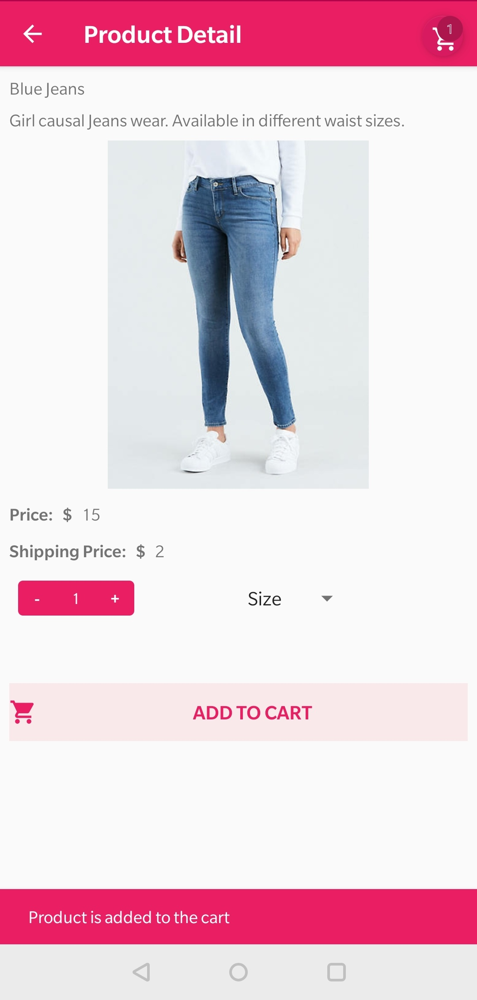
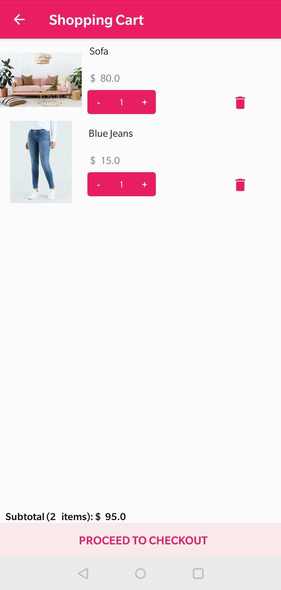
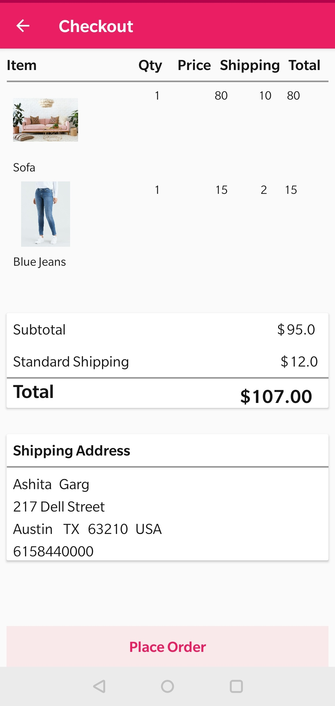
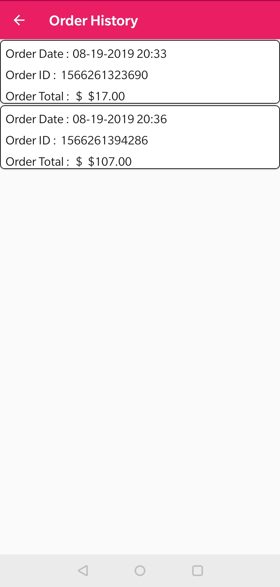

# ECommerce Android Application using Firebase and SQLite

It is a generic ECommerce Android application which supports the basic functionality of any ecommerce application. 
This template contains complete data flow and communication with backend.
Below are the features of the application.

Application display the list of categories. 

User can select any category, and all the products under that category will get displayed. The categories and their respective products are fetched from firebase. 

Once user will select product under any categry, a detailed information of product could be seen. 
Detail page also provided an option of selecting the number of desired items. 

Once user will select the product and click on 'Add to cart', product will be added in the shopping cart. 
The shopping cart will display items selected, item count as well as total price of all items.
User also have an option to change the quantity of product as well as to remove the item from the cart. 

Once the user is moved to checkout page, the checkout page displays the details of product, shipping address and order total.
If user is placing order for the first time, a customer dialog wil ask for delivery address details, along with his phone number, which will be saved in firebase database.
Finally order is placed and can be viewed under order history page. 

The order history page shows list of orders placed till date, user can click on any order to view which all products are ordered. 

